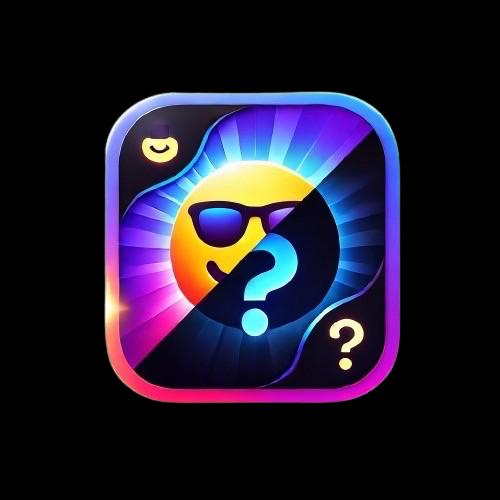

# Memory Card Matching Game

## Overview

This is a card matching game built for iOS using SwiftUI. Players flip two cards at a time and try to find matching pairs before time runs out. The project follows an MVVM architecture and started as a course project, then was extended with a scoring system, custom themes, and saved game history.

## Features

* Card matching gameplay with flip animations
* Scoring system that rewards fast matches and penalizes wrong guesses
* A countdown bonus timer shown on each card as a shrinking pie shape
* Custom theme editor for creating new emoji sets and accent colors
* Saved game history (time, score, and incorrect guesses) using UserDefaults
* Light and dark mode support
* Device motion integration using CoreMotion

## How It Works

The core game logic lives in a generic MemoryGame model. Each card tracks whether it is face up and whether it has been matched. When a player chooses a card, the model checks it against any other face up card and either marks both as matched or flips the mismatched card back down.

A view model (EmojiMemoryGameViewModel) wraps the model, publishes updates to the UI, tracks elapsed time with a timer, and saves finished games to history.

Scoring rules:

* A correct match adds four points
* A wrong guess subtracts one point
* Each card also has a bonus timer, so matching a card quickly earns a larger reward than matching it after it has sat face up for a while

## Project Structure

* Models: MemoryGame and ThemeCollection
* ViewModels: EmojiMemoryGameViewModel and ThemeCollectionManager
* Views: EmojiMemoryGameView, ThemeSelectionView, ThemeEditorView, GameHistoryView
* Structs: reusable shapes and layout helpers including Cardify, Grid, GridLayout, and Pie
* Extensions: small Swift utility extensions used across the app
* DefaultThemes: the built in theme presets
* Assets: app icons and color assets

## Requirements

* Xcode 13 or later
* iOS 15 or later
* Swift 5

## Getting Started

1. Clone the repository
2. Open the Xcode project file in Xcode
3. Select a simulator or a connected device
4. Build and run

## Demo Video

A short demo video of the app in action is included in this repository as Video Project.mp4.

## Credits

This project began as an assignment for Stanford's CS193p course (Spring 2020) and was extended by our team with additional features listed above. The original MIT License in this repository credits Archie Liu (2021) as the author of the base project structure.

## License

This project is distributed under the MIT License. See the LICENSE file for details.
